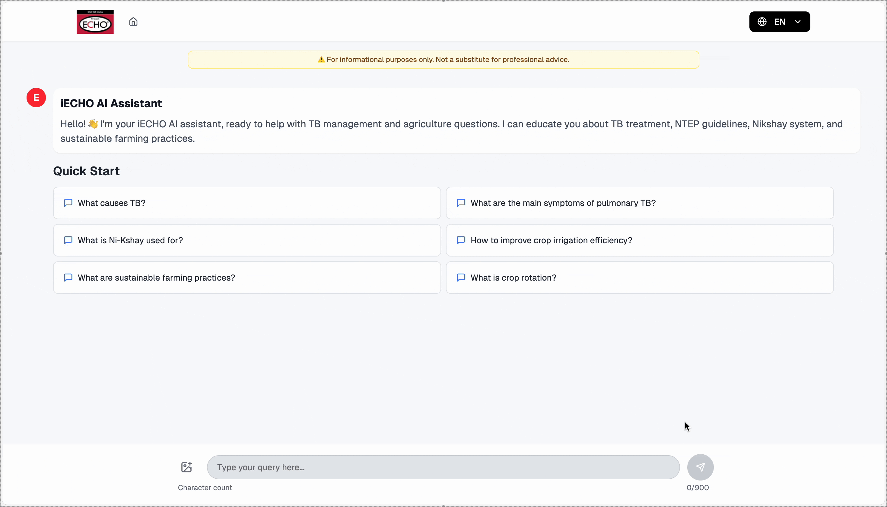

# iECHO RAG Chatbot — Portfolio Case Study

Multi-domain RAG on AWS Bedrock for frontline health and agriculture knowledge. Built with ECHO India and the ASU Artificial Intelligence Cloud Innovation Centre (AWS CIC).

This repository is a **portfolio mirror** of the upstream project. Implementation credit stays with the ASU CIC engineering team. My role was end-to-end product ownership: problem framing, partnering with AWS, architecture decisions, evaluation design, and the cost/accuracy bar.

**Upstream:** [ASUCICREPO/IECHO-RAG-CHATBOT](https://github.com/ASUCICREPO/IECHO-RAG-CHATBOT)



---

## My role

I led this as Head of Product & Innovation at ECHO India.

| I owned | The ASU CIC / AWS team owned |
|---|---|
| Problem, PRD, success metrics | Backend (FastAPI, Strands, EKS) |
| Architecture choices (S3 Vector, Bedrock, models) | Frontend (Next.js) |
| Golden datasets with domain SMEs | UI/UX design |
| Eval harness (exact-match, human-in-loop, LLM-as-judge) | Infrastructure as code (CDK) |
| Cost model vs ChatGPT Enterprise | Deployment and ops |
| Stakeholder path (CEO → AWS nonprofit → Seattle SA + 2 engineers) | Day-to-day implementation |

I also built an early prototype on Vercel to prove the path before the full AWS build, wrote and versioned system prompts, and specified product requirements (auth, first-time experience, image upload, suggested and follow-up questions, citations, feedback, sharing).

---

## The problem

ECHO serves hundreds of thousands of learners in tier 2/3 India: health workers, agriculture workers, educators. They need expert knowledge in the field. Public LLMs hallucinate on specialised content. ChatGPT Enterprise was roughly $36,000/year, which an NPO cannot sustain. Meanwhile ECHO sat on ~20 years of expert-validated knowledge that nobody could query at scale.

The job was not "add a chatbot." It was prove accurate, domain-grounded answers at a cost an NPO can keep paying, and get a serious technology partner to invest.

---

## What we built

Intelligent routing across specialist agents (TB, Agriculture, General) with Bedrock Knowledge Bases, citations, streaming answers, image upload, and feedback capture.

| Layer | Choice |
|---|---|
| Orchestration | Strands multi-agent routing |
| Retrieval | AWS Bedrock Knowledge Base + S3 Vector |
| Embeddings | Amazon Titan Text Embeddings |
| Generation | Amazon Nova (Lite / Pro in the evaluation path) |
| Compute | EKS Fargate behind API Gateway + ALB |
| Frontend | Next.js on Amplify |
| Feedback | DynamoDB |

Architecture detail: [`docs/architectureDeepDive.md`](./docs/architectureDeepDive.md)  
Screens and flows: [`docs/userGuide.md`](./docs/userGuide.md) · media in [`docs/media/`](./docs/media/)

---

## Results that mattered

- **96% exact-match accuracy** on a curated golden set built with in-house SMEs
- **About $6,000/year** run-rate vs roughly **$36,000/year** for ChatGPT Enterprise (about one-sixth the cost)
- Steady-state run-rate from the AWS CIC discovery workshop: about **$5,538/year** (~$462/month); Nova Lite inference about **$28.50/month**. One-time ingestion for a large corpus was separate (~$14K for ~60K docs). State the one-time number only when someone asks about TCO.
- AWS Seattle shared results internally. Their Global AVP visited the India office, took notes, and asked for a demo at an AWS India event.

External validation: Arun Anachalam (AWS, ASU CIC collaboration) later wrote publicly that I "translate complex GenAI concepts into actionable product decisions" and "take ambiguity and turn it into structured execution grounded in first principles."

---

## How I tell the story (STAR)

**Situation.** Hundreds of thousands of learners on low-end devices. They need expert knowledge. Public models invent answers on health and agriculture. We had decades of validated content locked in PDFs and sessions.

**Task.** Prove we could deliver accurate, domain-specific answers at NPO-sustainable cost, and get leadership plus a technology partner to fund the build.

**Action.**
1. Built a quick RAG proof-of-concept and demoed it to the CEO.
2. Pitched the AWS nonprofit unit on learner scale and downstream impact. They assigned a senior solution architect and two developers from Seattle.
3. Made the hard calls: S3 Vector for embeddings, Bedrock + Titan, model comparison on accuracy and cost (AWS, Hugging Face, and third-party eval tools).
4. Built golden test sets with SMEs. Exact-match validation, not vibes. Defined targets: >90% accuracy (hit 96%), <2s response, <10% fallback. Eval mix: confusion matrix, human-in-the-loop, LLM-as-judge.

**Result.** 96% accuracy at about $6K/year. AWS AVP flew to India. Asked for a public reference demo.

**What happened next.** There was pressure to productionalize immediately. I pushed back. We needed PHI/PII filtering, consent architecture, and multilingual support before scaling. The tech was ready. The org was not fully ready for compliance and sponsorship. That is part of the story, not a footnote. Accuracy without adoption is still unfinished product work.

---

## What I would probe in an interview

If you are hiring for AI product leadership, useful questions:

- How did you separate retrieval quality from answer quality?
- Why S3 Vector over a managed vector DB at that moment?
- When is 96% on a golden set *not* enough to ship?
- What would you change about the org readiness path if you ran it again?

My short answer on measurement: retrieval (precision@k, recall@k, ranking) and generation (faithfulness / groundedness) separately, plus embedding freshness as an ongoing monitor. Stale indexes fail quietly.

---

## Credits (implementation)

Developed at the **ASU Artificial Intelligence Cloud Innovation Centre**:

- **Sahajpreet Singh Khasria** — Backend ([LinkedIn](https://www.linkedin.com/in/sahajpreet))
- **Apoorv Singh** — Frontend ([LinkedIn](https://www.linkedin.com/in/apoorv16/))
- **Jenny Nguyen** — UI/UX ([LinkedIn](https://www.linkedin.com/in/jennnyen/))

Copyright (c) 2025 ASU Artificial Intelligence Cloud Innovation Centre. See [`LICENSE`](./LICENSE) (MIT). The MIT notice must stay with this software.

Original project README (technical index): [`docs/upstream-project-readme.md`](./docs/upstream-project-readme.md)  
Workshop / cost artifacts: [`docs/ECHO-Artifacts.pdf`](./docs/ECHO-Artifacts.pdf)

---

## Deploy and docs (from upstream)

| Doc | Purpose |
|---|---|
| [`docs/deploymentGuide.md`](./docs/deploymentGuide.md) | Deploy backend + frontend |
| [`docs/APIdoc.md`](./docs/APIdoc.md) | API surface |
| [`docs/agentCreation.md`](./docs/agentCreation.md) | Add specialist agents |
| [`docs/evaluationGuide.md`](./docs/evaluationGuide.md) | Model evaluation |
| [`docs/troubleshooting.md`](./docs/troubleshooting.md) | Common failures |

```
backend/      CDK + FastAPI multi-agent app (EKS Fargate)
frontend/     Next.js chat UI
docs/         Architecture, guides, media, this case study's sources
evaluation/   Dataset collection helpers
```

Clone upstream for the canonical remote, or use this mirror for portfolio review:

```bash
git clone https://github.com/ASUCICREPO/IECHO-RAG-CHATBOT.git
```

---

## Portfolio note

**Ankit Nakra** — Product & AI Leader  
[LinkedIn](https://linkedin.com/in/ankitnakra) · [GitHub](https://github.com/ankitnakra1986)

This mirror exists so hiring managers can see the system, the decisions, and the metrics in one place, with full credit to the people who wrote the production code.
